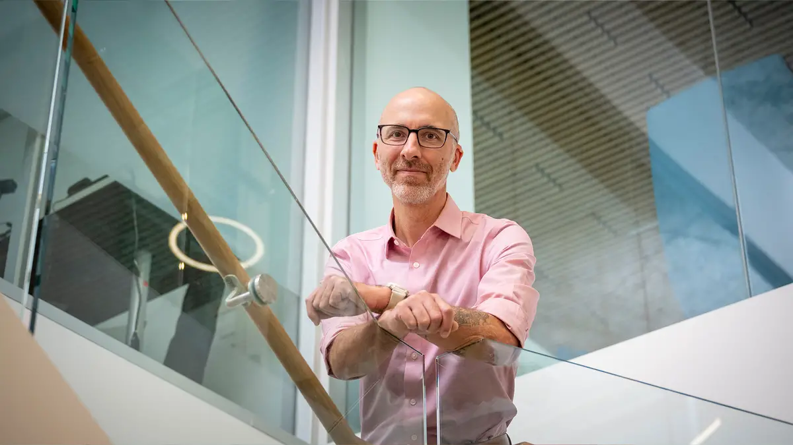

```{r, child="_setup.Rmd"}
```

```{r, out.width = "100%", fig.align = 'left', echo=FALSE}

```

|

---

## Ph. D. Candidate | Organizational Behavior & Theory
**Tepper School of Business, Carnegie Mellon University**

|
|

ChatGPT said:I study how people and organizations adapt as work becomes increasingly intertwined with artificial intelligence. My research explores what helps humans collaborate, learn, and stay creative when AI systems become part of the team. By examining the emotional and cognitive factors that shape these interactions, I aim to understand what makes human–AI collaboration effective, trustworthy, and humane. Ultimately, my work seeks to illuminate how technology can expand—not diminish—our capacity to work and think together.

|
|

[ORC ID](https://orcid.org/0000-0002-7241-2288)  |  [Google Scholar](https://scholar.google.com/citations?user=-PXl1V4AAAAJ&hl=en&oi=sra)

